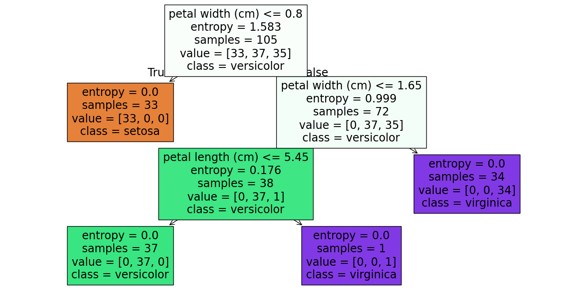
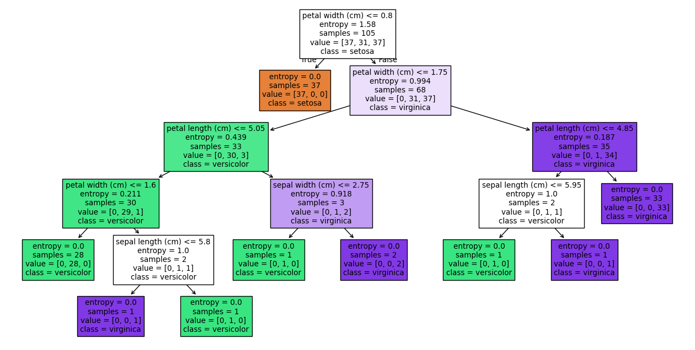
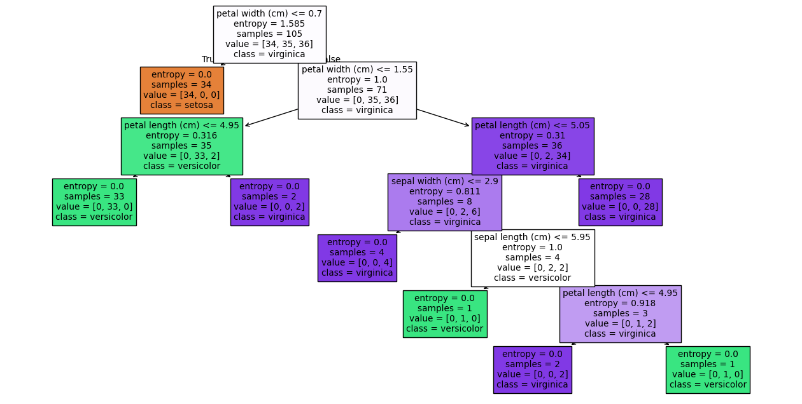
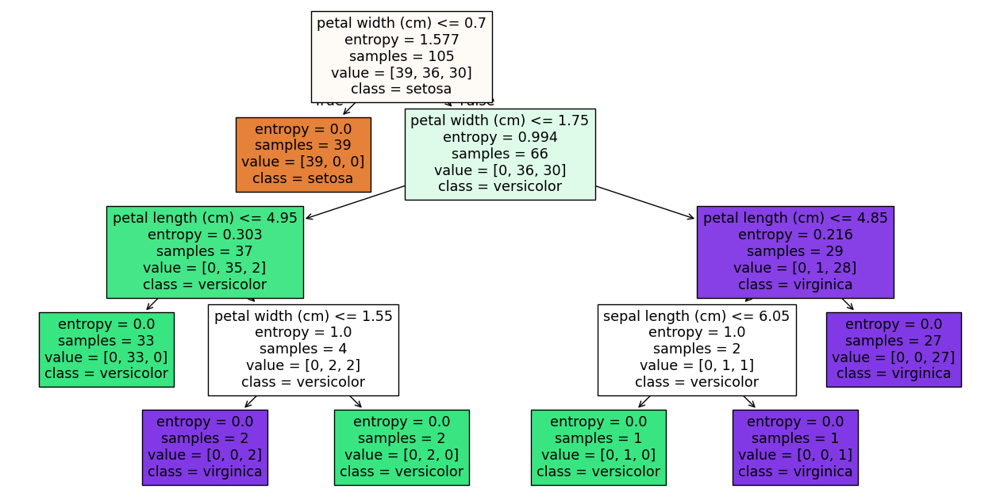

# Sistemas Inteligentes - Machine Learning

## 1. Descrição do Problema

Este trabalho tem como objetivo aplicar um modelo de classificação no dataset *Iris*, utilizando o algoritmo **DecisionTreeClassifier** disponibilizado pelo scikit-learn. O problema consiste na classificação de flores em três espécies distintas (Setosa, Versicolor e Virginica) com base nas medidas de quatro atributos: comprimento e largura das sépalas e das pétalas. O objectivo é treinar um modelo que seja capaz de prever correctamente a espécie da flor a partir dos dados fornecidos.

---

## 2. Descrição dos Conjuntos de Dados

O dataset Iris é um dos conjuntos de dados mais conhecidos na área de machine learning. Contém 150 amostras, divididas igualmente entre as três espécies de Iris: Setosa, Versicolor e Virginica. Cada amostra possui quatro atributos:

  * Comprimento da sépala (sepal length)
  * Largura da sépala (sepal width)
  * Comprimento da pétala (petal length)
  * Largura da pétala (petal width)

As classes estão equilibradas, com 50 amostras por espécie.

---

## 3. Descrição do Algoritmo Utilizado

O algoritmo utilizado neste trabalho foi o **DecisionTreeClassifier** da biblioteca `scikit-learn`. Este algoritmo constrói uma **árvore de decisão**, onde o nó raiz (Root Node) representa o conjunto de dados de treino, cada nó interno (Decision Node) representa uma pergunta sobre um atributo, os ramos (Branches) representam as respostas e cada folha (Leaf Node) representa o valor final que deve ser retornado (espécie da flor).

A árvore é construída de forma recursiva, dividindo o conjunto de dados com base nos atributos que melhor distinguem as classes, com o objetivo de maximizar a **pureza** em cada divisão. O algoritmo avalia todos os atributos e possíveis limiares (por exemplo, petal width <= 0.8) para encontrar a **divisão ideal**, ou seja, aquela que proporciona a melhor separação entre as diferentes classes. 

### Métricas
A qualidade da divisão pode ser avaliada utilizando uma das seguintes métricas:
#### Gini
A métrica Gini mede a impureza de um nó, ou seja,  quantifica o quão misturadas estão as classes num dado subconjunto de dados. Quanto mais equilibradas estiverem as quantidades das classes num nó, maior será a impureza. Por outro lado, se todas as amostras do nó pertencerem à mesma classe, a impureza será 0, indicando um nó puro. Fórmula:

$$
\text{Gini} = 1 -\sum_{i=1}^k p_i^2
$$

- $p_i$ é o número de elementos da classe $i$ no nó.
- $k$ é o número total de classes.

Um valor de Gini igual a 0 indica pureza total (nó puro, com apenas uma classe).

#### Entropy
A entropia é outra métrica utilizada para medir a impureza de um nó numa árvore de decisão. Representa o grau de desordem ou incerteza em relação à distribuição das classes num determinado subconjunto de dados. Quanto maior a entropia, maior a mistura de classes no nó; uma entropia igual a 0 indica que todas as amostras pertencem à mesma classe (nó puro). Fórmula:

$$
\text{Entropy} = -\sum_{i=1}^k p_i \log_2(p_i)
$$

- $p_i$ é o número de elementos da classe $i$ no nó.
- $k$ é o número total de classes.

A entropia atinge o valor máximo de 1 quando as classes estão igualmente distribuídas.

### Class Weight
O parâmetro `class_weight` é utilizado para ajustar a importância de cada classe durante o treino de um modelo de classificação, como o **DecisionTreeClassifier**.

Por exemplo, imagine um dataset com 90 amostras da classe **Cão** e apenas 10 amostras da classe **Gato**. Um modelo treinado sem qualquer ajuste pode simplesmente prever sempre a classe "Cão" e obter uma precisão de 90%. No entanto, o modelo será terrível na identificação de **Gatos**.

Para evitar este problema, o parâmetro `class_weight` permite atribuir um peso superior às classes menos representadas, fazendo com que o modelo lhes dê mais atenção durante o processo de aprendizagem.

---

## 4. Discussão das Principais Características do Algoritmo

As principais características do **DecisionTreeClassifier** são:

- **Interpretação fácil**: O modelo pode ser representado graficamente como uma árvore, sendo intuitivo perceber como as decisões são tomadas.
- **Não necessita de normalização**: Ao contrário de outros algoritmos, como o SVM, as árvores de decisão não requerem a normalização dos dados.
- **Propensão ao sobreajustamento (overfitting)**: Quando a árvore é muito profunda, pode memorizar os dados de treino. É possível controlar este comportamento com parâmetros como `max_depth`, `min_samples_split`, entre outros.
- **Sensível a pequenos ruídos nos dados**: Pequenas variações nos dados podem levar a árvores mais extensas e complexas.
- **Rapidez de treino e previsão**: Muito eficiente para datasets pequenos e médios.
- **Identificação de atributos relevantes**: Durante o processo de construção da árvore, o DecisionTreeClassifier avalia e determina quais atributos contribuem mais para a separação das classes, atribuindo maior importância aos que têm maior impacto na decisão final.

Apesar das suas vantagens, é importante considerar que árvores de decisão por si só podem não ser a melhor escolha para todos os problemas, especialmente quando se pretende um melhor desempenho em conjuntos de dados muito grandes ou complexos.

---

## 5. Estudo da performance, tempo e memória

Antes do treino do modelo, o conjunto de dados foi dividido em duas partes: treino e teste. Utilizou-se a função `train_test_split` da biblioteca scikit-learn, com o parâmetro `test_size=0.3`. Isto significa que 70% dos dados foram utilizados para treinar o modelo e os restantes 30% foram reservados para testar e avaliar o seu desempenho.

Número de Amostras:
- Treino: 105
- Teste: 45

A separação de dados para Treino e Teste é realizada de forma aleatória para obter resultados diferentes em cada iteração.

### Modelo 1

#### Diagrama

#### Matriz de Confusão

               setosa  versicolor  virginica
    setosa        17         0           0
    versicolor     0        11           2
    virginica      0         2          13

* **Linha 1**: Todas as amostras de *setosa* foram classificadas corretamente sem outros erros.
* **Linha 2**: 11 amostras de *versicolor* foram classificadas corretamente enquanto que 2 amostras de *versicolor* foram classificadas como *virginica*.
* **Linha 3**: 13 amostras de *virginica* foram classificadas corretamente enquanto que 2 amostras de *virginica* foram classificadas como *versicolor*.

#### Relatório de Classificação

                  precision    recall  f1-score   support

               0       1.00      1.00      1.00        17
               1       0.85      0.85      0.85        13
               2       0.87      0.87      0.87        15

        accuracy                           0.91        45

- **Precision**: Calcula quantos dos casos em que o modelo acertou são positivos.
$$ \text{Precision} = \frac{TP}{TP + FP} $$
- **Recall**: Calcula quantos positivos fomos capaz de prever correctamente.
$$ \text{Recall} = \frac{TP}{TP + FN} $$
- **F1-Score**:  Média harmónica de Precision e Recall.
$$ \text{Média Harmónica} = \frac{2ab}{a + b} $$
- **Support**: Representa o número de amostras de cada classe no conjunto de teste.
- **Accuracy** corresponde à proporção total de previsões corretas em relação ao número total de amostras avaliadas.
$$ \text{Accuracy} = \frac{TP + TN}{TP + TN + FP + FN} $$

#### Importância dos Atributos

| Feature           | Importância |
|-------------------|-------------|
| sepal length (cm) | 0.000000    |
| sepal width (cm)  | 0.000000    |
| petal length (cm) | 0.040128    |
| **petal width (cm)**  | 0.959872    |

A análise mostra que a **petal width (cm)** é o atributo mais relevante para a classificação, seguido pelo comprimento da pétala. Os atributos das sépalas têm pouca ou nenhuma influência no desempenho do modelo. O mesmo repete-se nos modelos seguintes.

### Modelo 2

#### Diagrama

#### Matriz de Confusão

               setosa  versicolor  virginica
    setosa        13         0           0
    versicolor     0        19           0
    virginica      0         2          11

* **Linha 1**: Todas as amostras de *setosa* foram classificadas corretamente sem outros erros.
* **Linha 2**: 19 amostras de *versicolor* foram classificadas corretamente sem outros erros.
* **Linha 3**: 11 amostras de *virginica* foram classificadas corretamente enquanto que 2 amostras de *virginica* foram classificadas como *versicolor*.

#### Relatório de Classificação

                  precision    recall  f1-score   support

               0       1.00      1.00      1.00        13
               1       0.90      1.00      0.95        19
               2       1.00      0.85      0.92        13

        accuracy                           0.96        45

#### Importância dos Atributos

| Feature           | Importância |
|-------------------|-------------|
| sepal length (cm) | 0.024109    |
| sepal width (cm)  | 0.016604    |
| petal length (cm) | 0.060117    |
| **petal width (cm)**  | 0.899170    |

### Modelo 3

#### Diagrama

#### Matriz de Confusão

               setosa  versicolor  virginica
    setosa        16         0           0
    versicolor     0        12           3
    virginica      0         0          14

* **Linha 1**: Todas as amostras de *setosa* foram classificadas corretamente sem outros erros.
* **Linha 2**: 12 amostras de *versicolor* foram classificadas corretamente enquanto que 2 amostras de *versicolor* foram classificadas como *virginica*.
* **Linha 3**: Todas as amostras de *virginica* foram classificadas corretamente sem outros erros.

#### Relatório de Classificação

                  precision    recall  f1-score   support

               0       1.00      1.00      1.00        16
               1       1.00      0.80      0.89        15
               2       0.82      1.00      0.90        14

        accuracy                           0.93        45

#### Importância das Features

| Feature             | Importância |
|---------------------|-------------|
| sepal length (cm)   | 0.007484    |
| sepal width (cm)    | 0.014967    |
| petal length (cm)   | 0.111000    |
| petal width (cm)    | 0.866550    |

### Modelo 4

#### Diagrama

#### Matriz de Confusão

               setosa  versicolor  virginica
    setosa        11         0           0
    versicolor     0        14           0
    virginica      0         3          17

* **Linha 1**: Todas as amostras de *setosa* foram classificadas corretamente sem outros erros.
* **Linha 2**: Todas as amostras de *versicolor* foram classificadas corretamente sem outros erros.
* **Linha 3**: 17 amostras de *virginica* foram classificadas corretamente enquanto que 3 amostras de *virginica* foram classificadas como *versicolor*.

#### Relatório de Classificação

                  precision    recall  f1-score   support

               0       1.00      1.00      1.00        11
               1       0.82      1.00      0.90        14
               2       1.00      0.85      0.92        20

        accuracy                           0.93        45

#### Importância das Features

| Feature             | Importância |
|---------------------|-------------|
| sepal length (cm)   | 0.012082    |
| sepal width (cm)    | 0.000000    |
| petal length (cm)   | 0.069471    |
| **petal width (cm)**    | 0.918447    |

### Custo do Tempo e Memória

| Modelo | Tempo de Execução (s) | Nós da Árvore  | Média de Nós Visitados | Soma dos Nós Visitados em Todas as Amostras |
|--------|-----------------------|----------------|------------------------|---------------------------------------------|
| 1      | 0.00200415            | 7              | 2.93                   | 132                                         |
| 2      | 0.00200033            | 17             | 3.91                   | 176                                         |
| 3      | 0.00152040            | 15             | 3.47                   | 156                                         |
| 4      | 0.00100112            | 13             | 3.58                   | 161                                         |
---

## 6. Discussão dos Resultados

A análise dos quatro modelos treinados com o algoritmo DecisionTreeClassifier demonstra que, apesar de pequenas variações nos dados de treino e teste, o desempenho global do classificador foi bastante elevado em todos os cenários. As métricas de precisão, recall e f1-score mantiveram-se consistentemente acima dos 0.85 para todas as classes, com valores de accuracy entre 91% e 96%.

Observa-se que a classe setosa foi sempre classificada corretamente, o que indica que esta espécie é facilmente separável das restantes com base nos atributos fornecidos. As principais confusões ocorreram entre as classes versicolor e virginica, refletindo a maior semelhança entre estas espécies em termos das suas características.

A análise da importância dos atributos revela que a largura da pétala **(petal width)** é, de longe, o atributo mais relevante para a classificação, sendo responsável por mais de 85% da importância em todos os modelos. O comprimento da pétala **(petal length)** surge como o segundo atributo mais relevante, enquanto os atributos das sépalas apresentam pouca ou nenhuma influência na decisão do modelo.

Em relação ao custo computacional, todos os modelos apresentaram tempos de execução muito reduzidos e árvores de decisão com poucos nós, o que demonstra a eficiência do algoritmo para problemas com esta dimensão e complexidade. As pequenas diferenças observadas no número de nós e na média de nós visitados refletem as diferenças nas divisões dos dados, mas não impactam significativamente o desempenho.

De forma geral, os resultados confirmam que o DecisionTreeClassifier é uma solução eficaz e eficiente para a classificação do dataset Iris, sendo capaz de atingir elevados níveis de precisão com baixo custo computacional.

## 7. Conclusão

Este trabalho demonstrou que o algoritmo DecisionTreeClassifier é eficaz na classificação de flores do conjunto de dados Iris. Os resultados obtidos mostram uma elevada precisão, com valores de accuracy entre 91% e 96%.

A espécie setosa foi sempre corretamente classificada, enquanto a maioria dos erros ocorreu entre as espécies versicolor e virginica, que possuem características mais semelhantes.

A largura da pétala revelou-se o atributo mais importante para a classificação, seguido do comprimento da pétala, enquanto os atributos das sépalas tiveram pouca influência.

O algoritmo apresentou ainda tempos de execução muito reduzidos e modelos simples, o que comprova a sua eficiência e facilidade de interpretação em relação ao dataset *Iris*. No geral, o DecisionTreeClassifier mostrou ser uma boa escolha para este tipo de problema de classificação.
