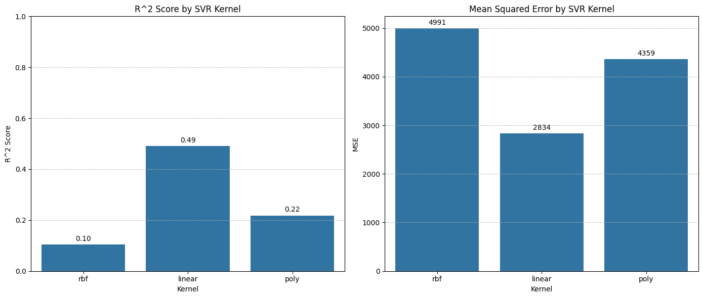
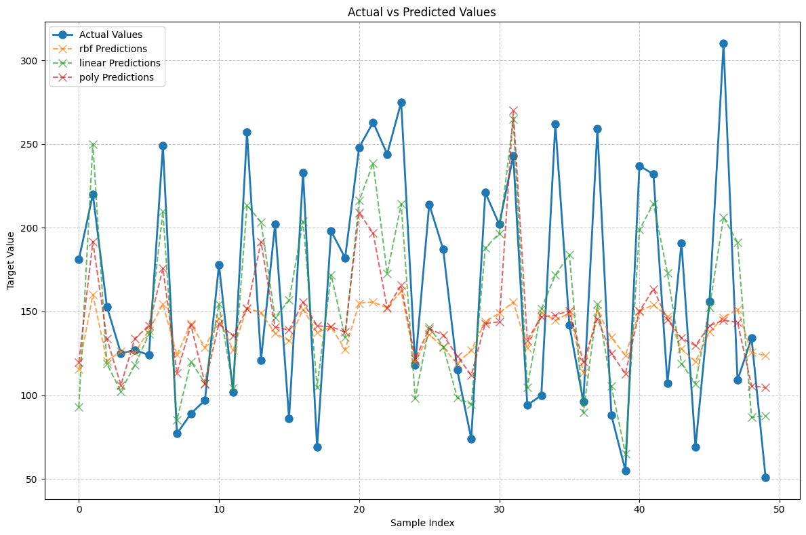
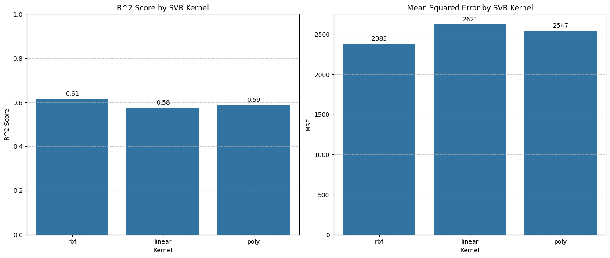
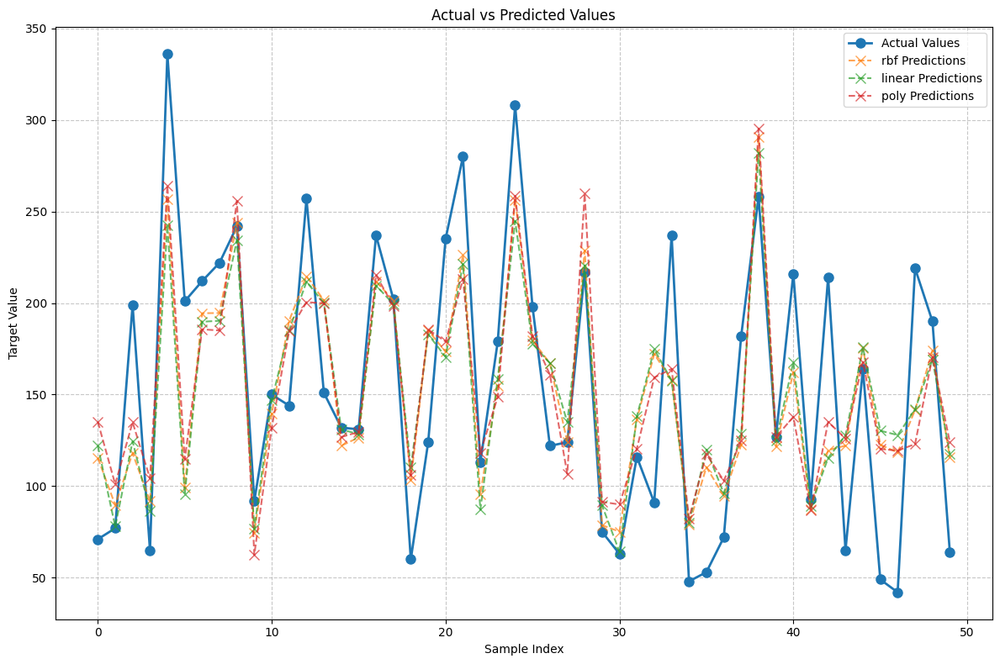
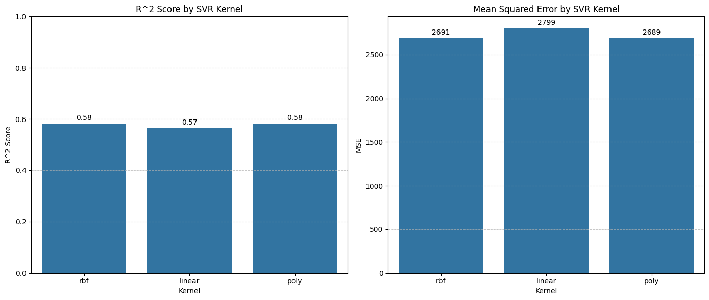
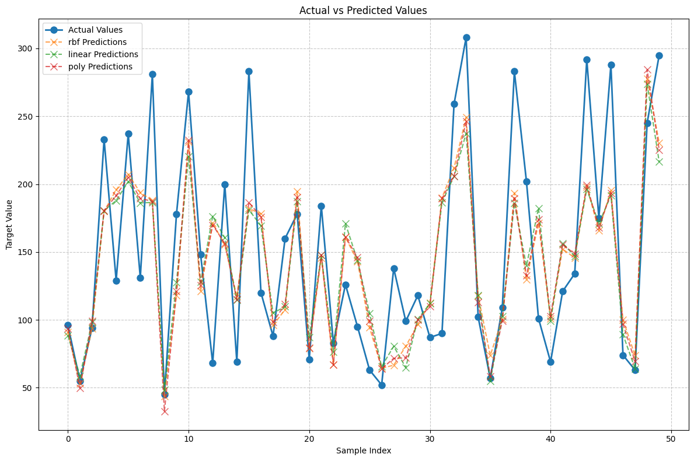
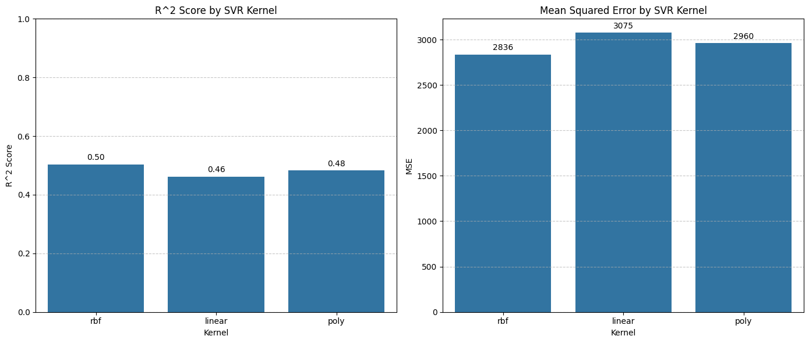
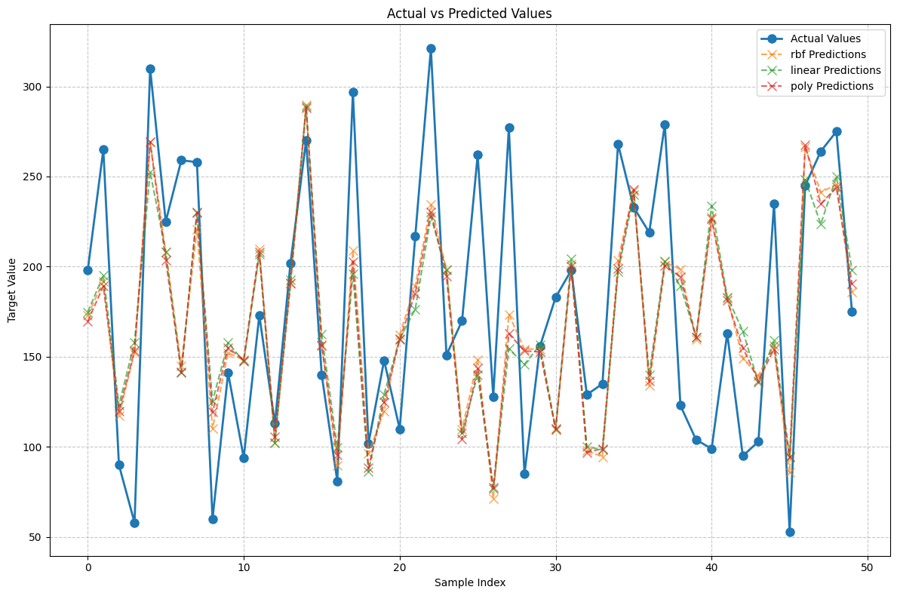

# Sistemas Inteligentes - Machine Learning

## 1. Descrição do Problema

Este trabalho tem como objetivo aplicar e analisar o desempenho do modelo **SVR (Support Vector Regression)**, utilizando a biblioteca scikit-learn, sobre o dataset *Diabetes*. O objetivo é prever valores contínuos (progressão da doença) a partir de dez atributos clínicos, avaliando a performance, tempo de execução e uso de memória para diferentes kernels do SVR.

---

## 2. Descrição dos Conjuntos de Dados

O dataset *Diabetes* da scikit-learn contém 442 amostras, cada uma com 10 atributos numéricos (idade, sexo, IMC, pressão arterial, entre outros) e um valor target (progressão da doença um ano após a medição). O conjunto de dados é bastante utilizado para tarefas de regressão.

---

## 3. Descrição do Algoritmo Utilizado

O **SVR (Support Vector Regression)** é uma extensão do SVM (Support Vector Machine) para problemas de regressão. O objetivo do SVR é construir uma função de regressão que consiga prever o valor target de cada amostra com um erro máximo de *ε* **(epsilon)**, procurando ao mesmo tempo manter o modelo simples e evitar ajustes desnecessários aos dados.

### Epsilon (ε)
O parâmetro **epsilon** define uma margem de tolerância ao erro em torno da função de regressão. Apenas os pontos cujos resíduos (diferença entre valor real e previsto) excedem esta margem contribuem para o ajuste do modelo. Isto torna o SVR resistente a pequenas flutuações, já que apenas os pontos fora da "zona epsilon" afetam a solução.

### vectores de Suporte
No SVR apenas uma parte dos dados (**vectores de suporte**) influenciam diretamente a construção do modelo. Estes são os pontos que se encontram fora da margem epsilon e, por isso, determinam a posição e a forma da função de regressão. Os restantes pontos, dentro da margem, não afetam o modelo final, o que contribui para a eficiência e capacidade de generalização do SVR.

### Funções Kernel
O SVR utiliza funções **kernel** para transformar os dados de entrada num espaço de maior dimensão, permitindo modelar relações não-lineares entre as variáveis. Os principais kernels utilizados são:

- **Linear**: Assume uma relação linear entre os atributos e o alvo. É indicado quando os dados seguem uma tendência linear.
- **RBF**: Permite capturar relações não-lineares complexas, projetando os dados num espaço de dimensão superior. É o kernel mais utilizado devido à sua flexibilidade.
- **Polinomial**: Modela relações polinomiais de diferentes graus, permitindo ajustar padrões mais complexos, mas pode aumentar o risco de sobreajustamento.

A escolha do kernel e dos hiperparâmetros (`C`, `epsilon`, `gamma`, `degree`, etc...) influencia diretamente a capacidade de generalização e o desempenho do modelo.

### C (Regularização)

O parâmetro **C** controla a penalização aplicada aos pontos que ficam fora da margem epsilon, ou seja, aos vectores de suporte com perda diferente de zero. Este parâmetro funciona como um fator de regularização no SVR.

Quando **C** é elevado, o modelo torna-se menos tolerante a desvios para além da margem epsilon, tentando ajustar-se o mais possível a todos os pontos, o que pode levar ao **overfitting**. Por outro lado, um valor baixo de **C** torna o modelo mais permissivo a desvios, permitindo que alguns pontos fiquem fora da margem sem grande penalização, resultando numa curva de regressão mais simples e com maior capacidade de generalização.

### Gamma

O parâmetro gamma define o alcance da influência de cada ponto de treino no modelo, especialmente quando se utiliza um kernel como o RBF. Um valor baixo de gamma faz com que cada ponto tenha uma influência mais abrangente, levando a uma função de regressão mais suave e com maior capacidade de generalização. Por outro lado, um valor elevado de gamma restringe essa influência a pontos muito próximos, tornando o modelo mais sensível aos dados de treino e com maior risco de sobreajustamento (overfitting).

Em resumo, o SVR é um algoritmo versátil para regressão, capaz de se adaptar a diferentes padrões nos dados através da escolha adequada do kernel e dos seus parâmetros.

---

## 4. Discussão das Principais Características do Algoritmo

As principais características do **SVR** são:

- **Versatilidade**:  Permite a utilização de diferentes kernels (linear, RBF, polinomial), adaptando-se tanto a relações lineares como não-lineares.
- **Tolerância a desvios/erros**: O parâmetro ***epsilon*** define uma margem de tolerância ao erro, tornando o modelo menos sensível a pequenas flutuações.
- **Regularização**: O parâmetro `C` controla o equilíbrio entre o erro no treino e a complexidade do modelo, ajudando a evitar overfitting.
- **Exige pouca memória**: O modelo final depende de um número relativamente pequeno de vectores de suporte.
- **Rápida previsão**: Especialmente quando existem poucos vectores de suporte.
- **Baixa escalabilidade**: O processo de treinamento pode ser computacionalmente exigente em conjuntos de dados grandes, especialmente com kernels não lineares.
- **Necessidade de normalização**: É fundamental normalizar os dados antes do treino para garantir bom desempenho, devido à sensibilidade do algoritmo à escala dos atributos.

---

## 5. Estudo da Performance, Tempo e Memória

Antes do treino do modelo, o conjunto de dados foi dividido em duas partes: treino e teste. Utilizou-se a função `train_test_split` da biblioteca scikit-learn, com o parâmetro `test_size=0.2`. Isto significa que 80% dos dados foram utilizados para treinar o modelo e os restantes 20% foram reservados para testar e avaliar o seu desempenho. Os dados foram normalizados com `StandardScaler` para garantir que as diferentes escalas dos atributos não afetassem o desempenho do SVR.

Para cada kernel (linear, rbf e polinomial), foram testadas várias combinações de parâmetros usando `GridSearchCV` com validação cruzada (cross-validation), de forma a encontrar os melhores parâmetros para cada caso.

### Resultados e Performance 1 (parâmetros default)

O **R^2 Score** indica o quão bem o modelo consegue prever os valores reais do alvo.
O **MSE** (Mean Squared Error) mostra o erro médio das previsões: quanto menor o valor, mais próximas estão as previsões dos valores reais.

#### Tempo de Execução

| Kernel   | Tempo de Treino (s) |
|----------|---------------------|
| Linear   | 0.0040                 |
| RBF      | 0.0050                 |
| Poly     | 0.0070                 |

#### Utilização de Memória

| Kernel   | Nº vectores de Suporte | Tamanho Total do Modelo (bytes) |
|----------|----------------------|--------------------|
| Linear   | 351                  | 32660                |
| RBF      | 353                  | 32844                |
| Poly     | 353                  | 32844                |

#### Visualização das Previsões por Kernel

### Resultados e Performance 2 (com paramêtros optimizados)

#### Tempo de Execução

| Kernel   | Tempo de Treino (s) |
|----------|---------------------|
| Linear   | 0.0080                 |
| RBF      | 0.0100                 |
| Poly     | 0.0130                 |

#### Utilização de Memória

| Kernel   | Nº vectores de Suporte | Tamanho Total do Modelo (bytes) |
|----------|----------------------|--------------------|
| Linear   | 347                  | 32292                |
| RBF      | 349                  | 32476                |
| Poly     | 353                  | 32844                |

#### Visualização das Previsões por Kernel

### Resultados e Performance 3 (com paramêtros optimizados)

#### Tempo de Execução

| Kernel   | Tempo de Treino (s) |
|----------|---------------------|
| Linear   | 0.0040                 |
| RBF      | 0.0070                 |
| Poly     | 0.0060                 |

#### Utilização de Memória

| Kernel   | Nº vectores de Suporte | Tamanho Total do Modelo (bytes) |
|----------|----------------------|--------------------|
| Linear   | 348                  | 32384                |
| RBF      | 353                  | 32844                |
| Poly     | 353                  | 32844                |

#### Visualização das Previsões por Kernel

### Resultados e Performance 4 (com paramêtros optimizados)

#### Tempo de Execução

| Kernel   | Tempo de Treino (s) |
|----------|---------------------|
| Linear   | 0.0070                 |
| RBF      | 0.0070                 |
| Poly     | 0.0050                 |

#### Utilização de Memória

| Kernel   | Nº vectores de Suporte | Tamanho Total do Modelo (bytes) |
|----------|----------------------|--------------------|
| Linear   | 349                  | 32476                |
| RBF      | 349                  | 32476                |
| Poly     | 353                  | 32844                |

#### Visualização das Previsões por Kernel

---

## 6. Discussão dos Resultados

Os resultados obtidos mostram que o desempenho do SVR depende tanto do kernel escolhido como dos parâmetros utilizados. Ao comparar os diferentes kernels, verifica-se que o kernel RBF (com parâmetros optimizados) apresentou resultados ligeiramente superiores em termos de **Mean Squared Error (MSE)** e **R^2 Score** quando comparado com os kernels linear e polinomial. O kernel linear, apesar de ser mais simples e rápido, não foi tão eficaz na previsão, apresentando desempenhos ligeiramente inferiores em comparação com os restantes kernels com parâmetros optimizados.

Relativamente à utilização de memória, verifica-se que o número de vectores de suporte e o tamanho total do modelo variaram ligeiramente entre os kernels. De um modo geral, os modelos com kernels mais flexíveis (RBF e polinomial) tendem a utilizar mais vectores de suporte, o que se reflete num maior consumo de memória. No entanto, as diferenças não foram muito acentuadas neste conjunto de dados, o que pode estar relacionado com a dimensão do dataset.

Observa-se que, devido ao tamanho relativamente pequeno do conjunto de dados utilizado, não houve grandes diferenças nos resultados de performance e utilização de recursos entre os diferentes kernels e configurações testadas. Em datasets maiores ou mais complexos, seria expectável que essas diferenças fossem mais evidentes.

Por fim, destaca-se a importância da escolha adequada dos parâmetros, para optimizar o desempenho de cada kernel.

---

## 7. Conclusão

O SVR mostrou-se uma solução flexível para regressão, permitindo adaptar-se a diferentes padrões nos dados através da escolha do kernel e ajuste dos hiperparâmetros. Os resultados mostram que, para o dataset Diabetes, não se verificaram grandes diferenças de desempenho, tempo de treino ou utilização de memória entre os diferentes kernels testados, principalmente devido ao tamanho relativamente pequeno do conjunto de dados. Ainda assim, o kernel RBF apresentou ligeira vantagem em termos de precisão, enquanto o kernel linear destacou-se pela simplicidade e rapidez.

Concluindo, o SVR apresentou um desempenho razoável, sendo importante considerar as características do problema e a predictabilidade do dataset para obter melhores resultados com este algoritmo.